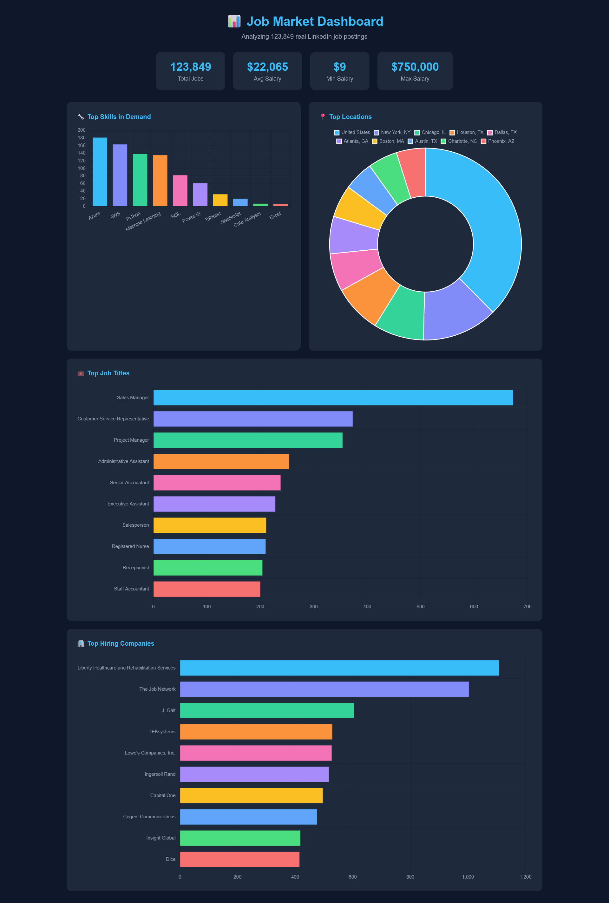

# 📊 Job Market Dashboard

🌐 **Live Demo:** 
https://job-market-dashboard-tkel.onrender.com  
*(may take ~1 min to load on first visit — free tier goes to sleep when inactive)*

A data analysis project that processes 123,849 real LinkedIn job postings and displays insights in an interactive web dashboard.

Built to practice real-world data analysis skills using Python, SQL, and data visualization.

## 🔍 What It Analyzes

- 💼 Top job titles in demand
- 🏢 Top hiring companies
- 📍 Most active hiring locations
- 🔧 Most in-demand tech skills (Python, SQL, Azure, AWS...)
- 💰 Salary statistics (min, average, max)

## 🛠️ Tech Stack

| Layer | Tool |
|---|---|
| Data processing | Python, Pandas |
| Storage | SQLite |
| Web server | Flask |
| Visualization | Chart.js |
| Dataset | LinkedIn Job Postings 2024 (Kaggle) |

## 📸 Dashboard Preview

## 🚀 How to Run

**1. Clone the repository**
git clone https://github.com/rceren/job-market-dashboard.git
cd job-market-dashboard

**2. Create and activate virtual environment**
python -m venv venv
venv\Scripts\activate

**3. Install dependencies**
pip install requests pandas flask beautifulsoup4 openpyxl

**4. Download the dataset**
Download from [Kaggle](https://www.kaggle.com/datasets/arshkon/linkedin-job-postings) and place `postings.csv` in the project folder.

**5. Parse the data**
python parser.py

## 💡 Key Insights

- **123,849** job postings analyzed
- **Azure & AWS** are the most in-demand cloud skills
- **New York** is the top hiring city
- Average salary across all roles: **$22,065**

## 👩‍💻 Author

Ruveyda Ceren Gokce — [LinkedIn]https://www.linkedin.com/in/ruveyda-ceren-gokce-67519a24a/